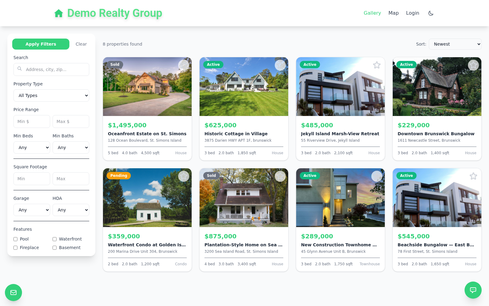
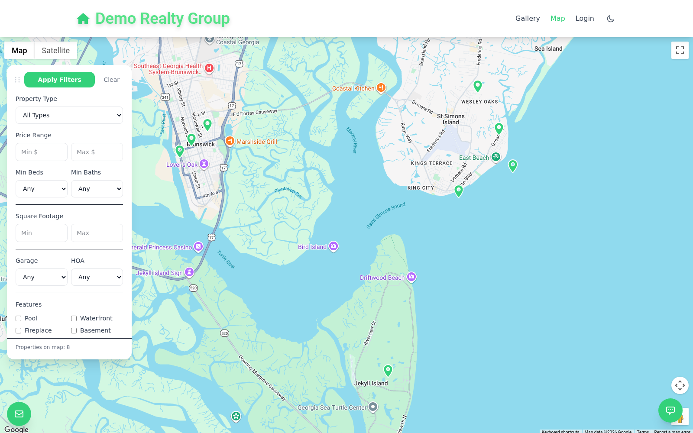
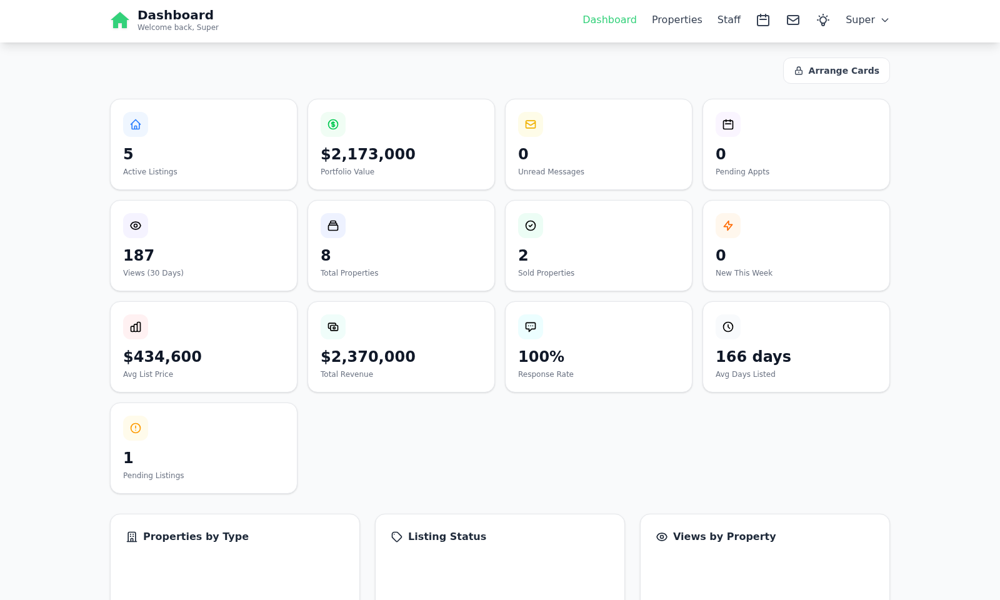
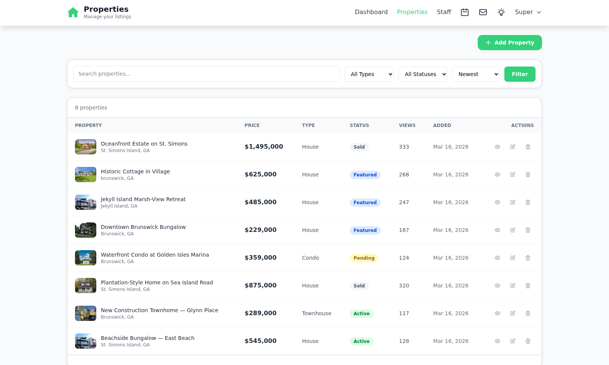
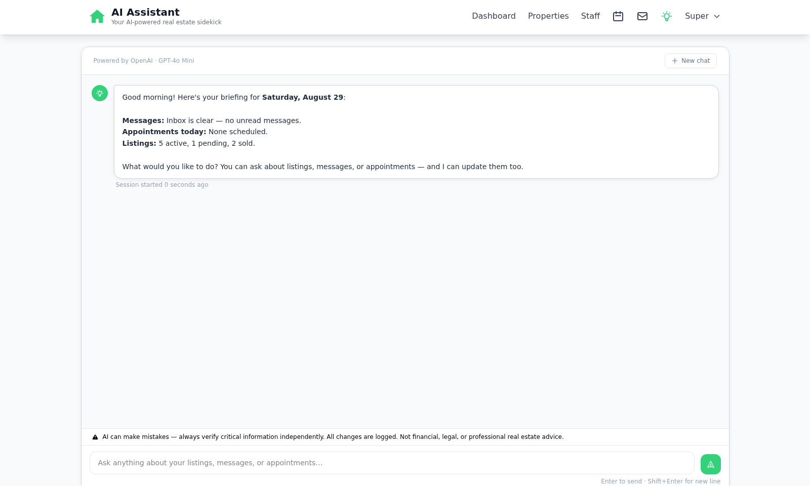

<h1 align="center">BusyRealtor</h1>

<p align="center"><strong>Real estate websites for modern agents — launch in minutes, not months.</strong></p>

<p align="center">
A multi-tenant website builder for real estate agents and brokers: property listings,
an interactive map, appointment booking, and an AI assistant that can manage your
listings for you — all with no developer required.
</p>


<p align="center"><a href="https://busyrealtor.com/demo-realty"><strong>View the live demo →</strong></a></p>

---

## What it is

BusyRealtor is a Laravel app that gives each agent or brokerage their own branded
real estate website, spun up from a setup wizard rather than a codebase. Every tenant
gets a public-facing site — listings, gallery, interactive map, contact form — plus an
admin dashboard to manage it, without touching code.

## Features

- **A full website per agent** — home, gallery, interactive map, property detail
  pages, and a contact form, all under your own branding.
- **Listings management** — create, edit, and photograph properties from the admin
  dashboard; drag to reorder photos, set a primary image, mark sold/pending.
- **Interactive map search** — every listing plotted on Google Maps, filterable by
  type, price, beds/baths, square footage, and features (pool, waterfront, etc).
- **Appointment booking** — visitors book showings from the public site; syncs to
  Google Calendar; admins manage requests from a queue.
- **AI assistant (BYOK)** — bring your own Anthropic or OpenAI key. A chat-driven
  assistant in the admin dashboard that can look up and update your listings,
  messages, and appointments through tool calls, plus a visitor-facing chatbot
  widget that can answer questions and book appointments on your behalf.
- **AI-generated listing descriptions** — draft property copy from the same
  BYOK provider instead of writing it by hand.
- **Staff accounts** — add team members to a tenant with their own logins.
- **Social auto-posting** — push new listings to X (Twitter) automatically.
- **Billing built in** — Stripe subscriptions (via Laravel Cashier) for Starter
  and Pro plans, 14-day free trial, no card required to start.
- **SEO out of the box** — JSON-LD structured data, sitemap.xml, and an
  `llms.txt` for AI crawlers.
- **Platform console** — a super-admin area for managing tenants, impersonating
  an account for support, activity logs, and platform-wide settings.

## The public site

Every tenant gets a search-friendly listings site out of the box.

<table>
<tr>
<td width="50%"><br><sub>Homepage — search, hero, quick links</sub></td>
<td width="50%"><br><sub>Gallery — filterable listing grid</sub></td>
</tr>
</table>


<p align="center"><sub>Every listing plotted on an interactive map, filterable the same way as the gallery.</sub></p>

## The admin dashboard

Manage the whole site without touching code.



<table>
<tr>
<td width="50%"><br><sub>Listings — add, edit, track views and status</sub></td>
<td width="50%"><br><sub>AI assistant — chat-driven, can act on listings/messages/appointments</sub></td>
</tr>
</table>

## Pricing

| | Starter | Pro |
|---|---|---|
| **Price** | $29/mo | $59/mo |
| Listings | Up to 10 | Unlimited |
| Public website & contact forms | ✓ | ✓ |
| Admin dashboard & custom branding | ✓ | ✓ |
| AI chatbot & assistant | — | ✓ |
| Appointment scheduling | — | ✓ |
| Google Maps & Analytics | — | ✓ |
| Staff accounts | — | ✓ |

14-day free trial, no credit card required.

## Built with

Laravel · Blade · Alpine.js · Tailwind CSS · MySQL/MariaDB · Laravel Cashier
(Stripe) · Laravel Socialite · Google Maps & Calendar APIs · Anthropic & OpenAI
(BYOK)

## Self-hosting

The repo ships a one-command installer for a fresh Debian 13 / Ubuntu 22.04+
box (Apache or Nginx):

```bash
sudo bash install.sh --domain=example.com --repo=https://github.com/yourorg/busyrealtor.com.git
```

Or set it up by hand: copy `.env.example` to `.env`, fill in your database,
mail, Stripe, and (optionally) AI provider credentials, then run the usual
Laravel setup —

```bash
composer install && npm install && npm run build
php artisan key:generate
php artisan migrate
```

See `.env.example` for the full list of configuration options.

> **⚠️ Change the seeded passwords immediately.** The database seeder creates a
> super-admin and a demo-tenant admin with a fixed default password (`secret`).
> That's fine for a local sandbox, but since it's a fixed value in this public
> repo's source, anyone can read it — rotate both passwords before the site is
> reachable from the internet.

---

<p align="center"><sub>© 2026 BusyRealtor · A Punchlist Labs product</sub></p>
